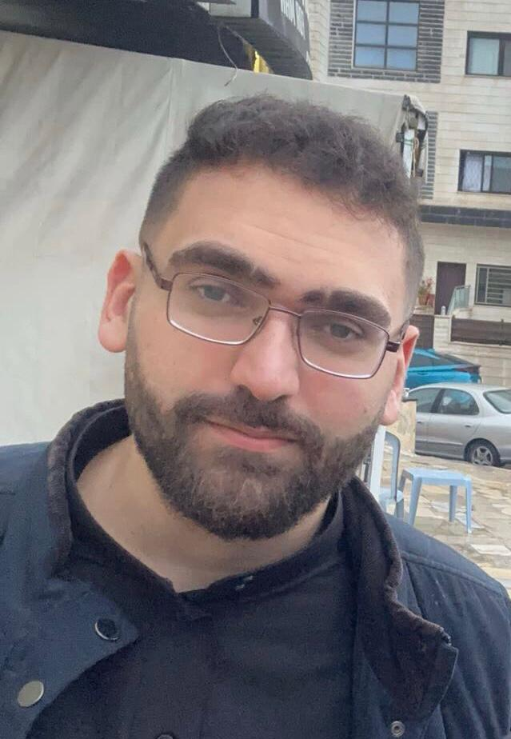

## Bio

My name is Abdullah Abuhalimeh, I am 22 years old, a CIS (Computer information systems) fresh graduate from the Hashemite university, I'm now a student in LTUC learning .Net course.

## Today's Lecture Highlights

In today's lecture, I have learned:

- The difference between GUI and CLI
- Understood basic terminal commands
- Understood VCS
- Learnt what is Git
- Learnt basic Git commands
- Learnt what is Github
- Learnt the difference between Git and GitHub
- Learnt Markdown language with its features.
